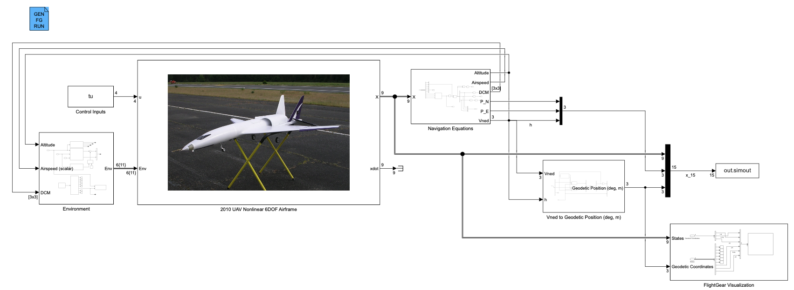
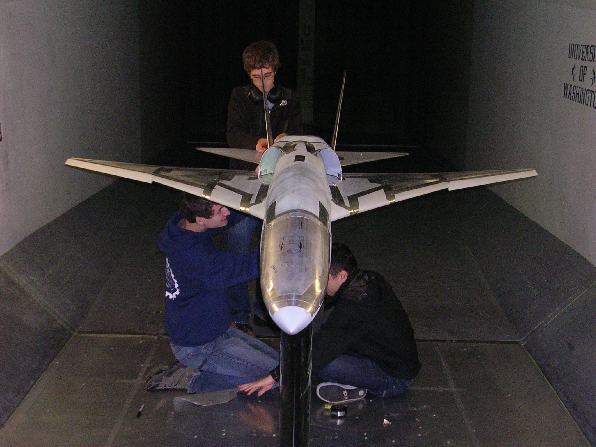
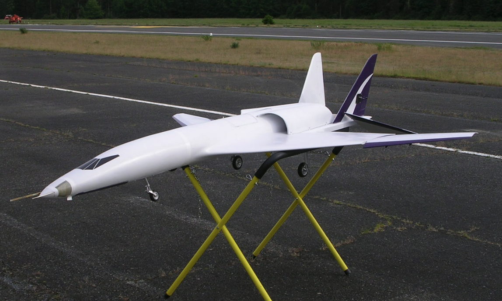

# Airframe Simulation and Control

## Code Repository and Tutorials/Articles on Simulation and Control of Fixed Wing Aircraft
This repository is a being used as a collection of code and resources on stability and control of fixed wing aircraft. Programming languages and tools used in this repository include the following:

* MATLAB
* Simulink
* Python (Coming soon)
* C/C++ (Coming Soon)

## Aircraft Models Used and Referenced in This Library
### Noise Shielding Research Aircraft
The Noise Shielding Reasearch Aircraft (NSRA) was developed and built in 2010 under the University of Washington Aeronautics and Astronautics Department's Senior Capstone Program. That year, a wind tunnel model was tested in the Kirsten Wind Tunnel. That wind tunnel data is used in this repository to develop the dynamic model of the aircraft. 

The same year, the aircraft was built and test flown. The aircraft sat in the UW A&A composite shop for nearly 13 years. In 2023 it was brought back to life and flown by the UW A&A Capstone Program with funding from AeroTech.

### Long Range Autonomous Testbed Aircraft
Work in progress...
